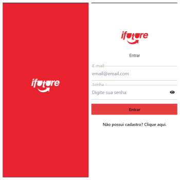
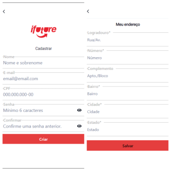
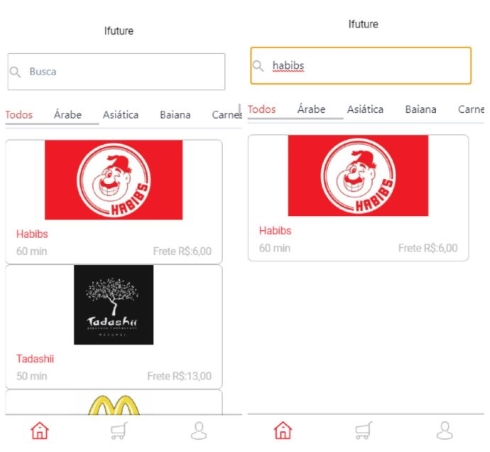
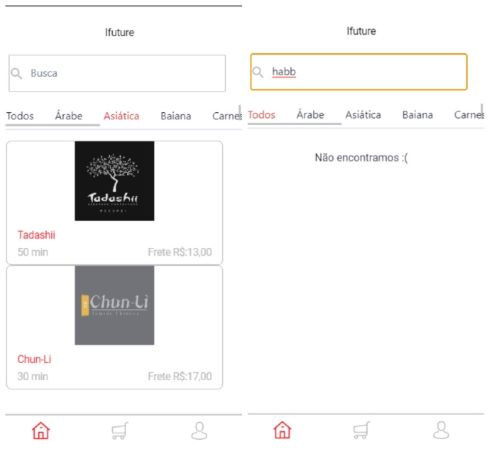
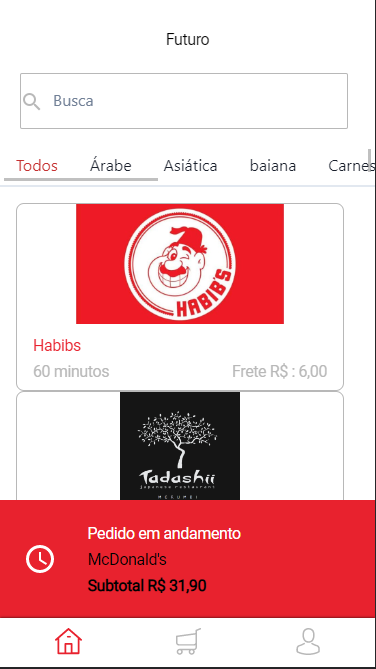
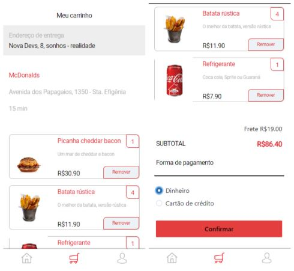
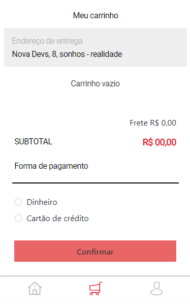
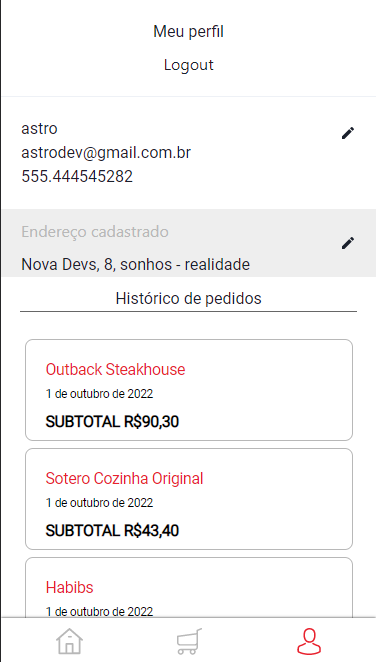
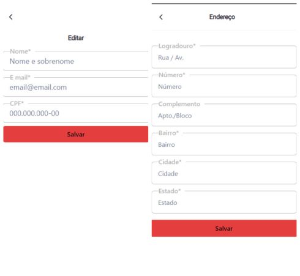

---

## 📱 Responsividade: 
- Para melhor experiência recomendamos a visualização em dispositivo Mobile ou no desktop visualizar pelo inspecionar do seu navegador.
---

<h4 align="left">
    Aplicativo web para serviços de delivery de restaurantes.
</h4>

---

## 🔐 Acesso:
- Cadastre-se ou acesse com login e senha (login: astrodev@gmail.com senha:123456)

---

##  👩🏽👨🏾 Integrantes do grupo:

- [Bianca Giovana Paccola](https://github.com/BiancaPaccola)
- [Caroline Martins](https://github.com/CarolineMartins09)
- [Jeferson Beiertorf](https://github.com/Jeferson-Beiertorf)
- [Leonardo Barros de Souza](https://github.com/FluffyThread)
- [Luana Barbosa de Oliveira](https://github.com/deoliveiraluana)

---

##  🎯Objetivo do Projeto

Este é um projeto de Front-end, baseado em aplicativos de delivery de comida, desenvolvido no bootcamp da Labenu. Por ser o último projeto do módulo de Front-end o principal objetivo é estudar e compreender todas tecnologias utlizadas nesse módulo, sendo elas: 
* _React_
* [API](https://documenter.getpostman.com/view/7549981/SWTEdGtT#e6c05246-7dcc-483c-95a3-269792e59c37)
* _Javascript_
* _HTML_
* _Styled-components_
* _Chakra UI_

---
## 🔗Link para Acessar

- [Ifuture.com](https://hanging-fork.surge.sh/)

---

### 💡 Funcionalidades:
✅ Login   
✅ Cadastro mais Cadastro endereço  
✅ Feed, com busca por nome ou categorias do restaurante e detalhes como frete tempo de entrega 
✅ Feed, com aviso caso possua pedido em andamento 
✅ Restaurante, com seus detalhes e seus respectivos produtos podendo ser adicionados com quantidade escolhida ao carrinho   
✅ Carrinho de compras, com endereço de entrega, produtos escolhidos( caso não possuir tem mensagem de aviso) e forma de pagamento  
✅ Carrinho de compras, não é possivel realizar outro pedido quando tem outro em andamento, user recebe aviso sobre 
✅ Perfil, contendo nome do user, endereço e dados, adicionamos uma opção de logout  
✅ Perfil, user pode fazer mudanças nos seus dados pessoais e visualizar seu historico de pedidos

## 📷 Prints Páginas

## HOME e LOGIN

## Cadastro Dados e Endereço

## Feed e Feed filtro Busca por nome

## Feed filtro por tipo de restaurante e mensagem se não ouver nome procurado

## Feed com pedido em andamento

## Carrinho com pedido

## Carrinho vazio

## Perfil com histórico

## Edição do perfil 

