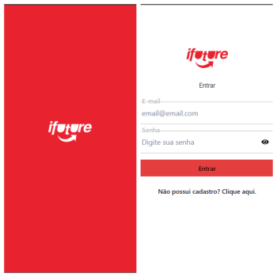

<!-- <h1 align="center">
     Labefood
</h1> -->

---

## 📱 Responsividade: 
- Para melhor experiência recomendamos a visualização em dispositivo Mobile ou no desktop visualizar pelo inspecionar do seu navegador.
---

<h4 align="left">
    Aplicativo web para serviços de delivery de restaurantes.
</h4>
---

## 🔐 Acesso:
- Cadastre-se ou acesse com login e senha (login: astrodev@gamil.com senha:123456),

---

##  👩🏽👨🏾 Integrantes do grupo:

- [Bianca Giovana Paccola](https://github.com/BiancaPaccola)
- [Caroline Martins](https://github.com/CarolineMartins09)
- [Jeferson Beiertorf](https://github.com/Jeferson-Beiertorf)
- [Leonardo Barros de Souza](https://github.com/FluffyThread)
- [Luana Barbosa de Oliveira](https://github.com/deoliveiraluana)

---

##  🧭Status do Projeto

 - ⏳ Fazendo
 - 📥 Testando 

---

##  🎯Objetivo do Projeto

Este é um projeto de Front-end, baseado em aplicativos de delivery de comida, desenvolvido no bootcamp da Labenu. Por ser o último projeto do módulo de Front-end o principal objetivo é estudar e compreender todas tecnologias utlizadas nesse módulo, sendo elas: 
* _React_
* !*[API]*(https://documenter.getpostman.com/view/7549981/SWTEdGtT#e6c05246-7dcc-483c-95a3-269792e59c37)
* _Javascript_
* _HTML_
* _Styled-components_
* _Chakra UI_

---
## 🔗Link para Acessar

- **Link do Surge:** 

---

### 💡 Funcionalidades:
✅ Login   

✅ Cadastro mais Cadastro endereço  
✅ Feed, com busca por nome ou categorias do restaurante e detalhes como frete tempo de entrega

✅ Restaurante, com seus detalhes e seus respectivos produtos podendo ser adicionados com quantidade escolhida ao carrinho
✅ Carrinho de compras, com endereço de entrega, produtos escolhidos( caso não possuir tem mensagem de aviso) e forma de pagamento
✅ Perfil, contendo nome do user endereço e dados
✅ 

## 📷 Prints Páginas

